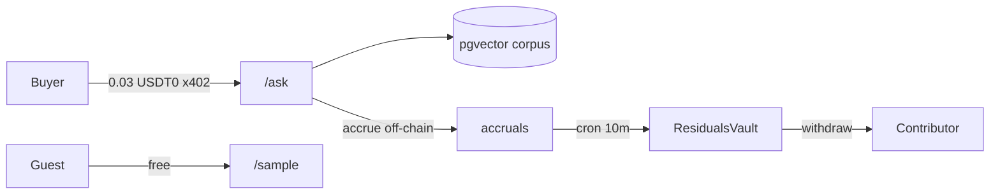

# RESIDUALS

**Practical how-to answers from a human knowledge corpus — with USD₮0 residuals to the people who were cited.**

RESIDUALS is an [OKX.AI](https://www.okx.ai) **A2MCP** Agent Service Provider on **X Layer** (`eip155:196`). Buyers pay **0.03 USD₮0** per `/ask`. Contributors withdraw a published share of those fees from an on-chain vault. No mocks. No fake settlement.

| | |
|--|--|
| **Live API** | https://residuals-api.onrender.com |
| **Live Web** | https://residuals-web.vercel.app |
| **Agent ID** | **#9374** (Listing under review) |
| **Vault** | [`0x068bB96e849F0DE3D49944Ec0F4aEd3D6B165770`](https://www.okx.com/web3/explorer/xlayer/address/0x068bB96e849F0DE3D49944Ec0F4aEd3D6B165770) |
| **Source of truth** | [`docs/SOURCE_OF_TRUTH.md`](./docs/SOURCE_OF_TRUTH.md) |



---

## Table of contents

1. [Idea in one minute](#1-idea-in-one-minute)  
2. [Monorepo layout](#2-monorepo-layout)  
3. [Prerequisites](#3-prerequisites)  
4. [Clone & install](#4-clone--install)  
5. [Configure environment](#5-configure-environment)  
6. [Database migrate & seed](#6-database-migrate--seed)  
7. [Run locally](#7-run-locally)  
8. [Test everything locally](#8-test-everything-locally)  
9. [Contracts (Foundry)](#9-contracts-foundry)  
10. [Paid mainnet e2e (optional)](#10-paid-mainnet-e2e-optional)  
11. [API cheat sheet](#11-api-cheat-sheet)  
12. [Production & listing](#12-production--listing)  
13. [Ops pitfalls](#13-ops-pitfalls)  
14. [Docs map](#14-docs-map)  
15. [License / copy rules](#15-license--copy-rules)

---

## 1. Idea in one minute

1. Humans contribute specific, non-obvious how-to knowledge + an X Layer address.  
2. A buyer (human or agent) calls `GET /ask?q=…`.  
3. Unpaid requests get **HTTP 402** + x402 `PAYMENT-REQUIRED`.  
4. After settlement, the API embeds the query, retrieves the best corpus entries, and answers **only** from that material.  
5. A share of the fee (`ROYALTY_BPS`, default 50%) accrues to cited contributors **off-chain**.  
6. Every ~10 minutes, cron credits `ResidualsVault`; contributors call `withdraw()` themselves.

Full architecture, wallets, txs, and history: **[`docs/SOURCE_OF_TRUTH.md`](./docs/SOURCE_OF_TRUTH.md)**.

---

## 2. Monorepo layout

```
residuals/
├── apps/api          # Express ASP + x402 + pgvector (the eligibility artifact)
├── apps/web          # React 18 + Vite UI (contribute, ask demo, ledger, withdraw)
├── packages/shared   # royalty split math + shared types
├── contracts/        # Foundry ResidualsVault.sol
├── docs/             # SOURCE_OF_TRUTH, LISTING, DEMO, SUBMISSION, DEPLOY
├── MEMORY.md         # agent progress log
├── Dockerfile        # API production image
├── render.yaml       # Render web + cron
└── vercel.json       # frontend deploy
```

**Workspaces:** `apps/*`, `packages/*` · **Node:** `>= 20`

---

## 3. Prerequisites

| Tool | Why |
|------|-----|
| **Node.js 20+** | Runtime for API + web |
| **npm** | Workspaces |
| **Postgres 16+** with **`pgvector`** | Corpus + embeddings (`CREATE EXTENSION vector;`) |
| **Foundry** (`forge`, `cast`) | Optional — vault unit tests / deploy |
| **OKX Web3 API keys** | x402 facilitator verify/settle |
| **Gemini and/or OpenRouter API key** | Embeddings (`gemini-embedding-001`, dim 768) |
| **X Layer funded EOA** | OKB for gas + USDT0 for paid tests (operator) |

Windows: PowerShell 7+ recommended. Quote `0x…` addresses in shells.

---

## 4. Clone & install

```bash
git clone https://github.com/mohamedwael201193/RESIDUALS.git
cd RESIDUALS

# Install all workspaces
npm install
```

If you only cloned into a parent monorepo path, use the `residuals/` directory as the project root (this README lives there).

---

## 5. Configure environment

```bash
cp .env.example .env
```

Edit `.env` and fill **every required** field. **Never commit `.env`.**

### Minimum to boot the API

| Variable | Purpose |
|----------|---------|
| `OKX_API_KEY` / `OKX_SECRET_KEY` / `OKX_PASSPHRASE` | x402 facilitator |
| `OKX_BASE_URL` | default `https://web3.okx.com` |
| `XLAYER_RPC_URL` | `https://rpc.xlayer.tech` |
| `CHAIN_ID` | `196` |
| `USDT0_ADDRESS` | `0x779Ded0c9e1022225f8E0630b35a9b54bE713736` |
| `PAY_TO` | Address that receives query fees |
| `OPERATOR_PRIVATE_KEY` | `0x` + 64 hex — vault operator + optional paid e2e |
| `RESIDUALS_VAULT_ADDRESS` | Deployed vault (prod: `0x068bB96e849F0DE3D49944Ec0F4aEd3D6B165770`) |
| `DATABASE_URL` | Postgres connection string (pgvector enabled) |
| `EMBEDDINGS_PROVIDER` | `gemini` (failover to OpenRouter on 429 if key set) |
| `EMBEDDINGS_API_KEY` | Gemini key |
| `EMBEDDINGS_MODEL` | `gemini-embedding-001` |
| `EMBEDDINGS_DIMENSIONS` | `768` |
| `OPENROUTER_API_KEY` | Recommended failover |
| `PUBLIC_BASE_URL` | Local: `http://localhost:3000` |
| `ADMIN_TOKEN` | ≥16 chars (validated at boot) |
| `CRON_SECRET` | ≥16 chars — header `x-cron-secret` for sweep |

### Frontend (same `.env` or `apps/web/.env.local`)

```env
VITE_API_BASE_URL=http://localhost:3000
VITE_VAULT_ADDRESS=0x068bB96e849F0DE3D49944Ec0F4aEd3D6B165770
VITE_CHAIN_ID=196
VITE_USDT0_ADDRESS=0x779Ded0c9e1022225f8E0630b35a9b54bE713736
```

### Recommended app knobs

```env
QUERY_PRICE_USD=0.03
ROYALTY_BPS=5000
MIN_RELEVANCE=0.40
TOP_K=4
EMBEDDINGS_TIMEOUT_MS=15000
PORT=3000
```

Full key list: `.env.example`. Narrative of every production address/tx: `docs/SOURCE_OF_TRUTH.md`.

---

## 6. Database migrate & seed

In Supabase (or any Postgres), ensure:

```sql
CREATE EXTENSION IF NOT EXISTS vector;
CREATE EXTENSION IF NOT EXISTS pgcrypto;
```

Then from repo root:

```bash
npm run migrate    # applies apps/api/migrations/*.sql
npm run seed       # loads apps/api/src/seed/corpus.jsonl (~89 entries)
```

Seed upserts contributors, embeds each body, inserts `entries` with 768-d vectors. Re-run is safe (skips existing contributor+topic pairs).

---

## 7. Run locally

### API (terminal 1)

```bash
npm run dev:api
# → http://localhost:3000
```

Quick smoke:

```bash
curl -s http://localhost:3000/health
curl -s "http://localhost:3000/sample?q=Egypt+national+ID+renewal"
curl -i "http://localhost:3000/ask?q=test"    # expect 402 + PAYMENT-REQUIRED
```

### Web (terminal 2)

```bash
npm run dev:web
# → Vite default http://localhost:5173
```

Open the UI: contribute form, ask demo, live ledger, withdraw panel.

### Production build (optional)

```bash
npm run build
npm run start -w @residuals/api   # needs dist/ + env
```

---

## 8. Test everything locally

### Unit / shared tests (no mainnet spend)

```bash
npm test
# equivalent:
npm run test -w @residuals/shared
npm run test -w @residuals/api
```

**Coverage today:**

| Suite | What |
|-------|------|
| `packages/shared` royalties | Proportional split, remainder, empty list |
| `apps/api` antifarm | Query hash, self-deal exclude, `distinct_payers >= 2` |
| `apps/api` env | Fail-fast missing OKX key |
| `apps/api` x402.payer | Reads `authorization.from` from `PAYMENT-SIGNATURE` |

### Typecheck & CI script

```bash
npm run typecheck
npm run ci          # typecheck + test + build
```

### Manual route checklist (local)

| Check | Command / expectation |
|-------|------------------------|
| Health | `GET /health` → `200` `ok:true`, `deps.database:true` |
| Deep health | `GET /health?deep=1` → embeddings true (or embedError message) |
| Sample | `GET /sample?q=…` → `200` with answer text |
| Ask unpaid | `GET /ask?q=test` → **402** + `PAYMENT-REQUIRED` |
| Ledger | `GET /ledger` → `200` JSON items |
| Contribute | `POST /contribute` JSON `{address,handle,topic,body}` → `201` |
| Sweep unauthorized | `POST /internal/sweep` without header → `401` |
| Sweep authorized | `POST /internal/sweep` + header `x-cron-secret: $CRON_SECRET` → `200` |

PowerShell sweep example:

```powershell
$cron = (Get-Content .env | Where-Object { $_ -match '^CRON_SECRET=' }) -replace '^CRON_SECRET=',''
Invoke-WebRequest http://localhost:3000/internal/sweep -Method POST -Headers @{ 'x-cron-secret' = $cron }
```

---

## 9. Contracts (Foundry)

```bash
cd contracts
forge test
```

Deploy (mainnet — only with a funded operator; already deployed in prod):

```bash
# see contracts/script/Deploy.s.sol and contracts/deployments/xlayer-196.json
```

**Vault surface:** `credit`, `withdraw`, operator transfer. Operator **cannot** pull contributor claimable balances.

---

## 10. Paid mainnet e2e (optional)

> **Spends real USD₮0** from `OPERATOR_PRIVATE_KEY` on X Layer. Use only when funded.

```bash
# Point at local or prod
# PowerShell:
$env:PUBLIC_BASE_URL = "http://localhost:3000"
# or
$env:PUBLIC_BASE_URL = "https://residuals-api.onrender.com"

npm run e2e:paid-ask -w @residuals/api
```

Related scripts (advanced):

| Script | Purpose |
|--------|---------|
| `apps/api/src/scripts/paid-ask.ts` | Operator paid `/ask` |
| `apps/api/src/scripts/second-payer-ask.ts` | Fund fresh EOA + paid ask (unlock 2 payers) |
| `apps/api/src/scripts/alt-payer-ask.ts` | Paid ask as `SECOND_PAYER_PRIVATE_KEY` |
| `apps/api/src/scripts/list-settled.ts` | Print recent `settled_tx` hashes |

Anti-farm: an entry accrues royalties only after **≥2 distinct payers** have paid for queries that cited it; payer-authored entries never earn from that payer.

---

## 11. API cheat sheet

```http
GET  /health
GET  /health?deep=1
GET  /sample?q=How+do+I+renew+Egypt+national+ID
GET  /ask?q=test                          → 402 unpaid
POST /ask  {"q":"…"}                      → 402 unpaid (same price)
GET  /ledger?limit=20&offset=0
GET  /contributor/0x…
POST /contribute
POST /internal/sweep                      → header x-cron-secret
```

Successful paid `/ask` body includes: `answer`, `charged`, `fee`, `paidDisplay`, `entryIds`, `scores`, `queryId`, `payer`.

---

## 12. Production & listing

| Piece | Detail |
|-------|--------|
| API | Render starter, Singapore — https://residuals-api.onrender.com |
| Cron | Every 10m → sweep |
| Web | Vercel — https://residuals-web.vercel.app |
| ASP | Agent **#9374** · Ask Query `0.03` · Sample Preview `0` |
| Listing copy | [`docs/LISTING.md`](./docs/LISTING.md) |
| Demo shot list | [`docs/DEMO.md`](./docs/DEMO.md) |
| Google form prep | [`docs/SUBMISSION.md`](./docs/SUBMISSION.md) |

Probe prod:

```bash
curl -i https://residuals-api.onrender.com/health
curl -i "https://residuals-api.onrender.com/ask?q=test"
curl -i "https://residuals-api.onrender.com/sample?q=Egypt+ID"
```

---

## 13. Ops pitfalls

- **GET law:** priced routes must support GET **and** POST (listing probe uses GET).  
- **10-second law:** every outbound call needs a timeout; never hang listing review.  
- PowerShell: pass service JSON to Onchain OS via **Node `spawnSync`**, not raw PS escaping.  
- Render env API is paginated; **redeploy** after env changes.  
- Build needs TypeScript available (`NPM_CONFIG_PRODUCTION=false` / include dev).  
- Sweep auth header is **`x-cron-secret`**, not `Authorization: Bearer`.  
- Do not put avatar **URLs** in listing — upload file ≤1 MB.  
- Never invent secrets or addresses in docs/code.

---

## 14. Docs map

| Document | Contents |
|----------|----------|
| [`docs/SOURCE_OF_TRUTH.md`](./docs/SOURCE_OF_TRUTH.md) | Full architecture, wallets, txs, timeline, diagrams |
| [`MEMORY.md`](./MEMORY.md) | Chronological build log |
| [`docs/LISTING.md`](./docs/LISTING.md) | Marketplace copy |
| [`docs/DEMO.md`](./docs/DEMO.md) | 90-second video beats + explorer links |
| [`docs/SUBMISSION.md`](./docs/SUBMISSION.md) | Hackathon form fields |
| [`docs/DEPLOY.md`](./docs/DEPLOY.md) | Deploy checklist |
| Parent `FINAL_PROMPT.md` / `WINNING_IDEA.md` | Original contest brief |

---

## 15. License / copy rules

User-facing copy must **never** claim guaranteed income, yield, APY, or “earn forever.”  
Describe payments only as a **published share of query fees**.

---

### Quick start (tl;dr)

```bash
git clone https://github.com/mohamedwael201193/RESIDUALS.git
cd RESIDUALS
npm install
cp .env.example .env   # fill secrets
# enable pgvector on your Postgres
npm run migrate && npm run seed
npm run test
npm run dev:api        # terminal 1
npm run dev:web        # terminal 2
```

For the complete system story — contracts, ASP #9374, every production tx, and recovery notes — read **[`docs/SOURCE_OF_TRUTH.md`](./docs/SOURCE_OF_TRUTH.md)**.
