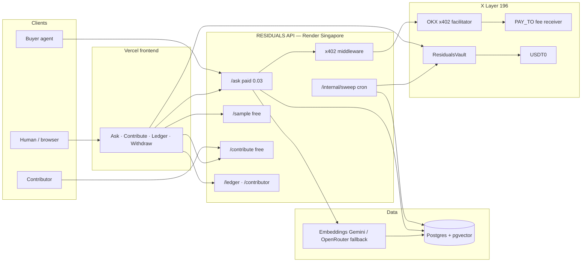
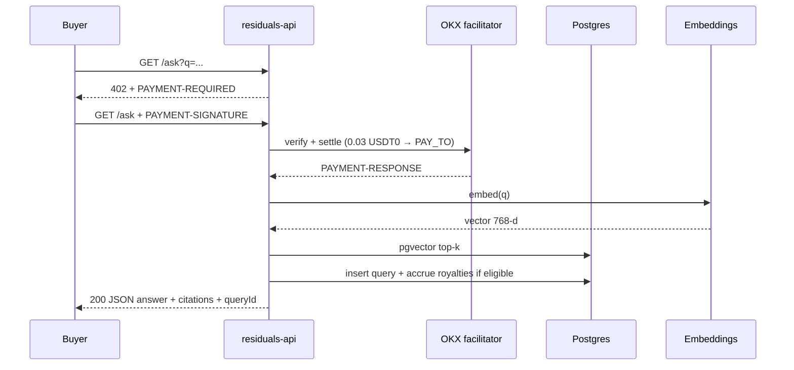
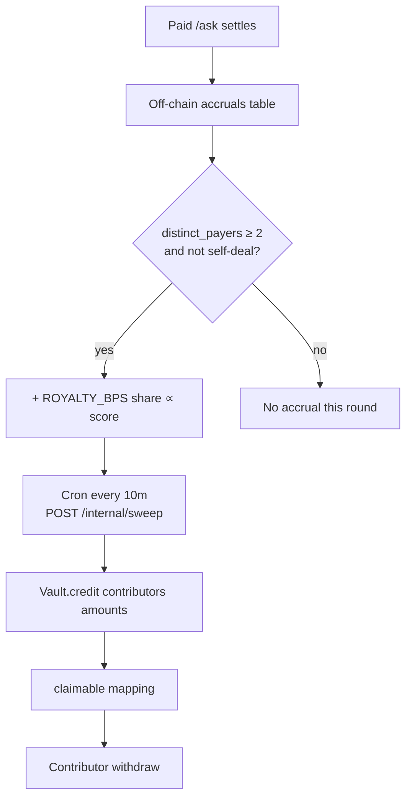

# RESIDUALS — Source of Truth

> **Canonical project documentation.** If this file conflicts with chat history, prefer this file + live production probes.  
> Last updated: **2026-07-26** · Hackathon: OKX.AI Creative Genius · Protocol: **A2MCP** · Chain: **X Layer (`eip155:196`)**

---

## 1. What RESIDUALS is

**RESIDUALS** is an OKX.AI **Agent Service Provider (ASP)** that answers practical *“how do I actually get this done”* questions from a **human-contributed knowledge corpus**, then accrues a **published share of the query fee** in **USD₮0** to the contributors whose entries were cited.

It is **not**:

- an MCP/SSE/JSON-RPC server  
- a yield / APY / “earn forever” product  
- a mock or demo-only stub  

It **is**:

- one always-on HTTPS API (A2MCP)  
- paid via **x402** on X Layer (`0.03` USD₮0 per `/ask`)  
- free preview via `/sample` (`fee: "0"`)  
- royalties off-chain per query, batched on-chain every ~10 minutes into **ResidualsVault**

**Hackathon target:** Creative Genius 1st place · Listing category intended: **Lifestyle** (OS currently shows `SOFTWARE_SERVICES` — fix in OKX UI when possible).

---

## 2. Live production surfaces

| Surface | URL |
|---------|-----|
| **API** | https://residuals-api.onrender.com |
| **Web** | https://residuals-web.vercel.app |
| **GitHub** | https://github.com/mohamedwael201193/RESIDUALS |
| **Render service** | https://dashboard.render.com/web/srv-d9iiedfaqgkc73a5ie1g |
| **Vault explorer** | https://www.okx.com/web3/explorer/xlayer/address/0x068bB96e849F0DE3D49944Ec0F4aEd3D6B165770 |
| **X Layer RPC** | https://rpc.xlayer.tech |
| **OKX facilitator** | https://web3.okx.com |

### ASP marketplace identity

| Field | Value |
|-------|--------|
| **Agent ID** | **#9374** |
| **Name** | RESIDUALS |
| **Role** | ASP |
| **Status (2026-07-26)** | **Listing under review** · remark: *AI quality review suggested pass* |
| **Create tx** | `0xc2a2a0b588fae107dc37ac1a057b9ccbdf595c0e72c7be2089f2031d07358bb5` |
| **Agentic Wallet** | `0xc8305a64c23627738445ca011b5b23662e4e8785` |
| **Ask Query** | `0.03` → `https://residuals-api.onrender.com/ask` · serviceId `c0c9a1e4-242e-469b-97c4-f91479d5174b` |
| **Sample Preview** | `0` → `https://residuals-api.onrender.com/sample` · serviceId `cc7a6d90-99a6-4c6d-8f08-4cbb2cd0ae31` |

---

## 3. Wallets & on-chain addresses (do not confuse)

| Role | Address | Purpose |
|------|---------|---------|
| **OPERATOR** | `0xf76e6B0920e9332fF4410f6dD53F01722AbC71a3` | EOA: gas (OKB), vault `credit`, local paid e2e buyer |
| **PAY_TO** | `0x94a18c39ac86b3a50f443db5083ec4132ab5e4f2` | Receives x402 query fees (OKX account address) |
| **Vault** | `0x068bB96e849F0DE3D49944Ec0F4aEd3D6B165770` | `ResidualsVault` on X Layer 196 |
| **USDT0** | `0x779Ded0c9e1022225f8E0630b35a9b54bE713736` | Settlement asset, **6 decimals**, EIP-712 name `USD₮0` |
| **Agentic Wallet** | `0xc8305a64c23627738445ca011b5b23662e4e8785` | ASP listing identity (Google Agentic Wallet) |
| **2nd payer (e2e)** | `0x135b181E86aA540C57351387cB61868Bf9776fBE` | Unlocked anti-farm `distinct_payers >= 2` |

**Vault deploy tx:** `0xe5c76d4c8d4b86875e7dcd85202949ffe46abbfd9a2e8f9bef51edfa55d22f85`  
**Smoke (PASS):** approve `0xed2a8156…` → credit `0x62bee7d8…` → withdraw `0x5fb965b5…`

---

## 4. Architecture (how everything works)

### 4.1 System context



### 4.2 Paid ask sequence



### 4.3 Two-ledger royalty design



**Why two ledgers:** keep `/ask` under the **10-second law** (target p95 &lt; 2s). Gas and batching happen asynchronously. Operator can **credit** but **cannot seize** contributor balances.

### 4.4 `/ask` pipeline (runtime)

1. Validate query length (3–500 chars)  
2. Embed query (`gemini-embedding-001` @ **768** dims; on Gemini **429**, fall back to OpenRouter same model)  
3. Retrieve top-`TOP_K` (default 4) with cosine ≥ `MIN_RELEVANCE` (default 0.40)  
4. Compose answer **only** from retrieved entry bodies (+ deterministic fallback)  
5. Persist immutable `queries` row  
6. If charged: `recordPayerSeen` → refresh `distinct_payers` → filter self-deal → `accrueRoyalties`  
7. Return JSON: `answer`, `charged`, `fee`, `paidMicros`, `entryIds`, `scores`, `queryId`, `payer`

### 4.5 Anti-farm rules

| Rule | Behavior |
|------|----------|
| Self-deal | Payer-authored entries excluded from royalty split |
| Bootstrapping | Entry accrues **nothing** until `distinct_payers >= 2` |
| Near-duplicate | Contributor cannot publish near-identical embeddings |
| Rate limit | Per-address publish cap (24h) |

---

## 5. ResidualsVault (contract)

**File:** `contracts/src/ResidualsVault.sol`  
**Address:** `0x068bB96e849F0DE3D49944Ec0F4aEd3D6B165770`

| Function | Access | Effect |
|----------|--------|--------|
| `credit(address[], uint256[])` | `onlyOperator` | `transferFrom` operator → vault; increase `claimable` |
| `withdraw()` | caller | zero then transfer full claimable to `msg.sender` |
| `beginOperatorTransfer` / `acceptOperatorTransfer` | operator / pending | 2-step operator handoff |

**Invariants:** no operator withdraw of others’ claimable; `ReentrancyGuard` on credit/withdraw; SafeERC20.

**Foundry tests:** `test_creditAndWithdraw`, length mismatch, non-operator revert, fuzz claimable ≤ balance.

---

## 6. HTTP API reference

Base: `https://residuals-api.onrender.com` (or `http://localhost:3000`)

| Method | Path | Auth | Notes |
|--------|------|------|-------|
| GET | `/health` | public | DB check; `?deep=1` also probes embeddings |
| GET/POST | `/sample` | public | Free shortened answer |
| GET/POST | `/ask` | **x402** | Unpaid → **402** + `PAYMENT-REQUIRED` |
| POST | `/contribute` | public | Free publish; embed + insert |
| GET | `/ledger` | public | Paginated audit + royalties |
| GET | `/contributor/:address` | public | Accrued / settled / pending |
| POST | `/internal/sweep` | header `x-cron-secret` | Batch vault `credit` |

**x402 facts:** network `eip155:196`, asset USDT0, payer from `PAYMENT-SIGNATURE.authorization.from`. Express `trust proxy` enabled for HTTPS challenges behind Render.

---

## 7. Repository layout

```
residuals/
├── apps/api/                 # ASP (Express + x402 + pgvector)
├── apps/web/                 # React 18 + Vite UI
├── packages/shared/          # royalty math + shared types
├── contracts/                # Foundry ResidualsVault
├── docs/
│   ├── SOURCE_OF_TRUTH.md    # THIS FILE
│   ├── LISTING.md            # marketplace copy
│   ├── DEMO.md               # 90s shot list + live txs
│   ├── SUBMISSION.md         # Google form prep
│   └── DEPLOY.md             # deploy checklist
├── MEMORY.md                 # session progress log
├── Dockerfile                # API image
├── render.yaml               # API + cron
├── vercel.json               # frontend
└── .env.example
```

---

## 8. Environment (names only)

Secrets live in **gitignored** `.env`. Never commit them.

Critical groups: OKX facilitator triplet · X Layer RPC/PAY_TO/OPERATOR/VAULT · `DATABASE_URL` · embeddings (`EMBEDDINGS_*`, `OPENROUTER_API_KEY` for failover) · `PUBLIC_BASE_URL` · `CRON_SECRET` · `AGENT_ID` · Vite `VITE_*`.

Production notes:

- Embeddings: prefer `gemini-embedding-001` + dim **768**; provider enum allows `gemini` | `openai` | `openrouter`  
- On Gemini quota **429**, API falls back to OpenRouter  
- `/health` is **DB-only** for deploy readiness; use `/health?deep=1` for embeddings  
- Render env changes require **redeploy** to take effect in the running process  

---

## 9. Timeline — what we built (begin → now)

| When | Milestone |
|------|-----------|
| Phase 0–2 | Monorepo, zod env, Postgres+pgvector migrations, shared royalty math |
| Phase 3 | Deploy + smoke `ResidualsVault` on X Layer 196 |
| Phase 4–5 | x402 `/ask` + `/sample`, retrieval, compose, antifarm, ledger |
| Phase 6 | Seed ~89 corpus entries (`corpus.jsonl`), embeddings indexed |
| Phase 7–8 | Local e2e paid settle; GitHub history (100 dated commits Jul 19–26) |
| Phase 9 | Render always-on API (Singapore) + cron sweep; Vercel web |
| Phase 10 | Prod probes green; payer extract fix; prod paid settles |
| Phase 11 | Onchain OS Agentic Wallet login; avatar; **ASP #9374**; services registered |
| Phase 12 | Codex ChatGPT OAuth (device-auth blocked → browser login); activate → **under review** |
| Phase 13 | 2nd payer funded; royalty bigint-id bug fixed; Gemini 429 → OpenRouter; royalties + vault credits live |
| Phase 14 | `docs/DEMO.md` + `SUBMISSION.md`; this Source of Truth + README overhaul |

### Notable production proofs

| Proof | Tx / result |
|-------|-------------|
| Paid settle | `0xa5b4b92581a065451eea9ca5bafaa21ab82aa6c313e74c1dde1ba55315a51d35` |
| Paid settle | `0x0b59404dcf460527716011293c97723d65fd66bfb1d6a80f49e3a6efa481aae2` |
| Paid settle | `0x708c0b38a524e12532560e0be59d3e7cd1a2f21c30bce1c68c9e0aaa74399e93` |
| Vault credit | `0xbe0bf50618e1367446762e3cf0134faadd5908c0d1d4f92dffad470873a7b002` |
| Vault credit | `0x590f89bbf8b11c2e4c0360692e73de474f92f9fb89bd4a61440a250c597cf46d` |
| Contributor seed `0x1111…1111` | Accrued/settled **$0.03** (two × $0.015) |

### Incidents fixed

1. **BIGINT ids as strings** → royalty inserts never matched → normalize `Number(id)` + refresh `distinct_payers`  
2. **`/health` called Gemini** → Render deploy hung → health is DB-only  
3. **Gemini 429** → OpenRouter embeddings fallback  
4. **`EMBEDDINGS_PROVIDER=openrouter` rejected by zod** → crash loop → enum updated  
5. **Codex device-auth Continue disabled** → browser `codex login` OAuth  

---

## 10. Ops & deploy

| Piece | How |
|-------|-----|
| API host | Render starter, Singapore, Docker/`Dockerfile` |
| Cron | `residuals-sweep` every 10m → `POST /internal/sweep` + `x-cron-secret` |
| Web | Vercel; `VITE_API_BASE_URL` → prod API |
| Secrets | Render/Vercel dashboards; local `.env` gitignored |
| Listing CLI | Onchain OS `onchainos.exe` + `okx-a2a`; Codex provider bound |

**Copy discipline:** never use *earn forever / passive income / guaranteed / yield / APY* in user-facing text. Always: *published share of query fees*.

---

## 11. Open items (as of last update)

- [ ] Marketplace **listed** (currently under review)  
- [ ] Category → **Lifestyle** in OKX UI  
- [ ] Demo video + X post `#OKXAI` + Google form (`docs/DEMO.md`, `docs/SUBMISSION.md`)  
- [ ] ≥10 external human contributors (seed corpus is multi-address but largely bootstrapped)  
- [ ] Optional: improve weak retrieval for some sample queries  

---

## 12. Related documents

| Doc | Role |
|-----|------|
| [README.md](../README.md) | Clone, local run, local test |
| [MEMORY.md](../MEMORY.md) | Chronological agent progress log |
| [LISTING.md](./LISTING.md) | Exact ASP listing copy |
| [DEMO.md](./DEMO.md) | 90s demo shot list + explorer txs |
| [SUBMISSION.md](./SUBMISSION.md) | Google form field checklist |
| [DEPLOY.md](./DEPLOY.md) | Deploy checklist |
| `../FINAL_PROMPT.md` | Original execution manual |
| `../WINNING_IDEA.md` | Strategy & demo narrative |

---

*End of Source of Truth.*
